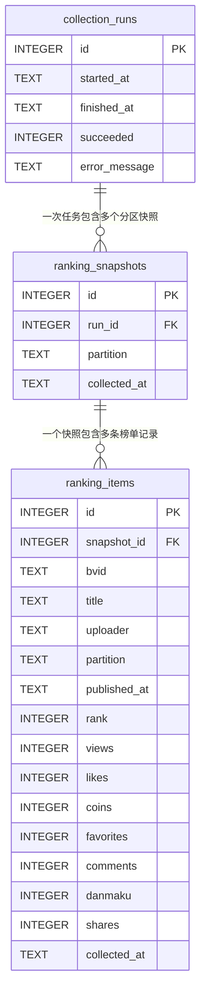

# Ranking Collector 数据存储结构

本文说明 `ranking_collector` 当前实际使用的 SQLite 数据结构、写入流程和查询方式。表结构以 [`repository.py`](repository.py) 中的 `CREATE_TABLES_SQL` 为准。

## 1. 数据库位置

默认数据库文件：

```text
data/ranking.db
```

路径由 [`config.py`](config.py) 中的 `DATABASE_PATH` 配置。连接数据库时会启用：

```sql
PRAGMA foreign_keys = ON;
PRAGMA busy_timeout = 5000;
```

- `foreign_keys`：启用外键和级联删除约束。
- `busy_timeout`：数据库被短暂占用时最多等待 5 秒。

所有时间在写入前都会转换成 UTC，并以 ISO 8601 字符串保存，例如：

```text
2026-08-09T19:51:55.799842+00:00
```

## 2. 表关系



层级关系如下：

```text
一次采集任务 collection_runs
├── 全站快照 ranking_snapshots
│   ├── 第 1 名 ranking_items
│   ├── 第 2 名 ranking_items
│   └── ...
├── 知识区快照 ranking_snapshots
│   └── 最多 100 条 ranking_items
├── 科技区快照 ranking_snapshots
├── 游戏区快照 ranking_snapshots
└── 生活区快照 ranking_snapshots
```

## 3. `collection_runs`：采集任务

一整轮采集对应一条 `collection_runs` 记录。一轮任务会依次采集所有启用分区。

| 字段 | SQLite 类型 | 是否必填 | 含义 |
|---|---|---:|---|
| `id` | `INTEGER` | 是 | 自增主键，也是代码中的 `run_id` |
| `started_at` | `TEXT` | 是 | 任务开始时间，UTC ISO 8601 |
| `finished_at` | `TEXT` | 否 | 任务结束时间；运行中为 `NULL` |
| `succeeded` | `INTEGER` | 否 | `1` 成功、`0` 失败、`NULL` 运行中 |
| `error_message` | `TEXT` | 否 | 失败分区的错误汇总；成功时为 `NULL` |

约束：

```sql
CHECK (succeeded IN (0, 1))
```

任务刚创建时只写入 `started_at`：

```text
succeeded = NULL
finished_at = NULL
```

所有分区处理结束后，`finish_collection_run()` 才会填写最终状态。已经结束的任务不能再次完成，也不能继续写入快照。

当前实现中，只要有一个启用分区失败，整轮任务的 `succeeded` 就会记为 `0`。已经成功写入的其他分区快照仍然保留。

## 4. `ranking_snapshots`：分区快照

一个分区在一次采集时间点的完整榜单对应一条快照记录。

| 字段 | SQLite 类型 | 是否必填 | 含义 |
|---|---|---:|---|
| `id` | `INTEGER` | 是 | 自增快照主键，即 `snapshot_id` |
| `run_id` | `INTEGER` | 是 | 所属采集任务，关联 `collection_runs.id` |
| `partition` | `TEXT` | 是 | 分区名称，例如“全站”“知识”“科技” |
| `collected_at` | `TEXT` | 是 | 本次快照采集时间，UTC ISO 8601 |

关系与约束：

```sql
FOREIGN KEY (run_id)
    REFERENCES collection_runs(id)
    ON DELETE CASCADE;

UNIQUE (run_id, partition);
```

因此：

- 同一轮采集的同一分区最多只能有一份快照。
- 删除一条采集任务时，它下面的所有分区快照会一并删除。
- 每轮采集都会新增快照，不会覆盖旧快照。

用于查询某分区最近快照的索引：

```sql
CREATE INDEX idx_snapshots_partition_time
ON ranking_snapshots(partition, collected_at DESC);
```

## 5. `ranking_items`：榜单视频记录

榜单中的每个视频对应一条 `ranking_items` 记录。默认每个分区快照最多保存 100 条；如果上游接口返回不足 100 条，则保存实际返回数量。

### 5.1 视频信息

| 字段 | SQLite 类型 | 约束 | 含义 |
|---|---|---|---|
| `id` | `INTEGER` | 主键、自增 | 榜单记录 ID |
| `snapshot_id` | `INTEGER` | 非空、外键 | 所属快照 |
| `bvid` | `TEXT` | 非空 | Bilibili BV 号 |
| `title` | `TEXT` | 非空 | 视频标题 |
| `uploader` | `TEXT` | 非空 | UP 主名称 |
| `partition` | `TEXT` | 非空 | 视频所在的采集分区 |
| `published_at` | `TEXT` | 非空 | 视频发布时间，UTC ISO 8601 |
| `rank` | `INTEGER` | `rank > 0` | 视频在本次榜单中的排名 |
| `collected_at` | `TEXT` | 非空 | 该记录的采集时间，UTC ISO 8601 |

### 5.2 累计指标

| 字段 | SQLite 类型 | 约束 | 含义 |
|---|---|---|---|
| `views` | `INTEGER` | `>= 0` | 累计播放量 |
| `likes` | `INTEGER` | `>= 0` | 累计点赞数 |
| `coins` | `INTEGER` | `>= 0` | 累计投币数 |
| `favorites` | `INTEGER` | `>= 0` | 累计收藏数 |
| `comments` | `INTEGER` | `>= 0` | 累计评论数 |
| `danmaku` | `INTEGER` | `>= 0` | 累计弹幕数 |
| `shares` | `INTEGER` | `>= 0` | 累计分享数 |

这些值是采集时的累计值，不是相对上一次采集的增量。

### 5.3 唯一性与外键

```sql
FOREIGN KEY (snapshot_id)
    REFERENCES ranking_snapshots(id)
    ON DELETE CASCADE;

UNIQUE (snapshot_id, bvid);
UNIQUE (snapshot_id, rank);
```

这些约束保证：

- 同一份快照中，同一个 BV 号不能出现两次。
- 同一份快照中，同一个排名不能分配给两个视频。
- 删除快照时，其下面的榜单记录会一并删除。

用于查询单个视频历史数据的索引：

```sql
CREATE INDEX idx_items_bvid_time
ON ranking_items(bvid, collected_at DESC);
```

## 6. 一轮采集如何写入数据库

`service.collect_once()` 和 `repository.py` 的写入顺序如下：

1. `initialize_database()` 创建数据库、数据表和索引。
2. `create_collection_run()` 插入一条运行中的采集任务。
3. Service 逐个请求启用分区。
4. 每个分区的原始 JSON 被转换成 `RankingSnapshot` 和 `RankingItem`。
5. `save_snapshot()` 在一个事务中写入一条快照及其全部榜单记录。
6. 某个分区失败时，记录错误并继续处理下一个分区。
7. 所有分区处理完成后，`finish_collection_run()` 更新任务状态。

`save_snapshot()` 使用同一个数据库事务写入快照和全部视频记录。如果其中任意一条违反约束，整个分区快照的写入会回滚，不会留下只有部分视频的不完整快照。

## 7. 快照与趋势数据的区别

数据库当前只保存每次采集的原始累计快照，不单独保存趋势计算结果。

`service.py` 会把同一 BV 号在前后两份快照中的数据相减，临时生成 `MetricChange`：

```text
views_delta
likes_delta
coins_delta
favorites_delta
comments_delta
danmaku_delta
shares_delta
rank_change
elapsed_hours
views_per_hour
```

这些字段当前只存在于本轮运行返回值中，没有对应的数据表。

如果一个视频只出现在本次榜单、没有出现在上一份榜单，就无法计算它的区间指标增量，但会被标记为新进榜。如果前后两份榜单完全不重合，快照仍会正常保存，持续在榜指标变化列表为空。

当前 Service 还会实时生成 `SnapshotComparison`，其中包括：

- `retained`：前后两次都在榜的视频。
- `entered`：本次新进榜的视频。
- `exited`：本次跌出榜的视频。
- `metric_changes`：持续在榜视频的指标变化。
- `ranking_risers`：按排名上升幅度排序的结果。
- `views_growth_ranking`：按每小时播放增量排序的结果。
- `turnover_rate`：新进榜数量除以当前榜单实际数量。

比较状态包括：

- `NO_BASELINE`：没有上一份快照。
- `VALID`：快照间隔不超过 24 小时，可以计算换血率。
- `STALE`：快照间隔超过 24 小时，继续返回其他变化，但换血率为空。
- `EMPTY_CURRENT`：当前榜单为空，不判断成员进出或换血率。

本轮采集失败时，可以使用最近两份历史成功快照生成 `LAST_VALID` 比较。该结果必须明确标记为历史比较，并保留真实快照时间。

`SnapshotComparison`、新进榜、跌出榜、排序结果和换血率都不会写入 SQLite，可以随时根据历史快照重新计算。

## 8. 示例数据结构

假设第 12 次采集成功保存了知识区榜单，数据库中的关系类似：

```text
collection_runs
└── id = 12
    ├── started_at = 2026-08-10T00:00:01+00:00
    ├── finished_at = 2026-08-10T00:00:25+00:00
    └── succeeded = 1

ranking_snapshots
└── id = 56
    ├── run_id = 12
    ├── partition = 知识
    └── collected_at = 2026-08-10T00:00:01+00:00

ranking_items
├── snapshot_id = 56, rank = 1, bvid = BV...
├── snapshot_id = 56, rank = 2, bvid = BV...
└── ...
```

## 9. 常用查询示例

### 9.1 查询某分区最新快照

```sql
SELECT *
FROM ranking_snapshots
WHERE partition = '知识'
ORDER BY collected_at DESC
LIMIT 1;
```

### 9.2 查询最新快照中的完整榜单

```sql
SELECT i.*
FROM ranking_items AS i
JOIN ranking_snapshots AS s ON s.id = i.snapshot_id
WHERE s.id = (
    SELECT id
    FROM ranking_snapshots
    WHERE partition = '知识'
    ORDER BY collected_at DESC
    LIMIT 1
)
ORDER BY i.rank ASC;
```

### 9.3 查询某个视频的历史指标

```sql
SELECT
    bvid,
    partition,
    rank,
    views,
    likes,
    coins,
    favorites,
    comments,
    danmaku,
    shares,
    collected_at
FROM ranking_items
WHERE bvid = 'BVxxxxxxxxxx'
ORDER BY collected_at ASC;
```

### 9.4 查询最近的采集任务

```sql
SELECT id, started_at, finished_at, succeeded, error_message
FROM collection_runs
ORDER BY id DESC
LIMIT 10;
```

## 10. 当前结构的边界

当前数据库结构可以支持：

- 保存各分区最多 100 条的历史榜单快照。
- 查询视频历史累计指标。
- 对比连续快照，计算持续在榜视频的增长速度。
- 判断采集任务是否整体成功。

当前尚未直接保存：

- `MetricChange` 趋势计算结果。
- 新进榜、跌出榜状态。
- 榜单换血率。
- 趋势评分或热度评分。
- 视频长期主数据表。

这些数据可以先从历史快照实时计算；当查询量增加时，再考虑增加派生结果表或缓存表。
